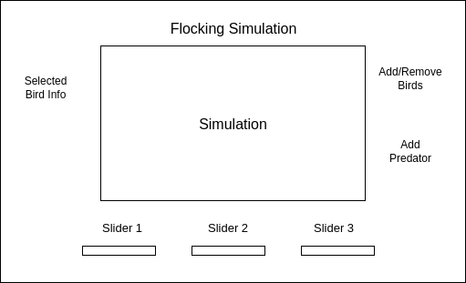

# Flocking Simulation Proposal

## Background

Flocking is a behavioral phenomenon of birds, with similar parallels in the grouping behavior of fish and swarming of insects. Flocking can be simulated based on mathematical principals applied to each and every bird. There are no lead birds, only a set of behavioral rules which apply equally to every bird in the flock.

## Minimum Viable Product

In this simulation, users will be able to access the following features:

- Basic canvas with the live simulation of flocking birds.
- Option to add more or less birds.
- Slider bars to adjust the parameters governing the flocking behavior, to observe changes in flocking behavior.
- Ability to pause and start simulation.
- Add third dimension Z-Axis to flocking equations.

Bonus Features:
- Add bird sprite animation.
- Ability to select a bird to track its movement and see the velocity and behavior.
- External predator factor applying to flocking, to see how a flock responds to danger.

## Wireframe

This simulation will be a single page application with links to my Github, LinkedIn. An information modal with pictures outlining the rules of the simulation will be available. The selected bird information will be displayed on the left side. The slider bars to control the simulation will be on the bottom, and will live update the behavior of the birds. The buttons to add/remove birds and as a bonus, add a predator will be on the right.

## Structure and Technologies

### Technologies

This simulation will implement the following technologies:
- Vanilla Javascript and JQuery for logic and structure
- HTML5 Canvas for DOM manipulation
- Webpack to group and apply the scripts

### Structure

The following design outlines the structure of the simulation.

`main.js` will handle updating the HTML5 Canvas with the necessary elements.

`bird.js` will define the individual bird object, and define the methods necessary to regulate the movement of the bird.

`flock.js` will manage the overall logic for the flock. It will call upon the bird methods, and provide information of all the other birds to each bird, as necessary. It will store the overall array of birds.

## Timeline

**Day 1**
- Setup file environment, webpack
- Design and outline 3 structure files
- Begin defining the mathematical equations of the birds

**Day 2**
- Get basic movement on the Canvas of a bird.
- Complete basic equations and interactivity between the birds.

**Day 3**
- Put the pieces together, birds flocking in the simulation
- Add slider bars to adjust weights of different variables

**Day 4**
- Styling, buttons to add/remove birds
- Simulation start and stop
- Individual bird selection

### Bonus

- External predator factor into the mathematical behavior
- Custom styling/animation on the bird object, improved graphics
